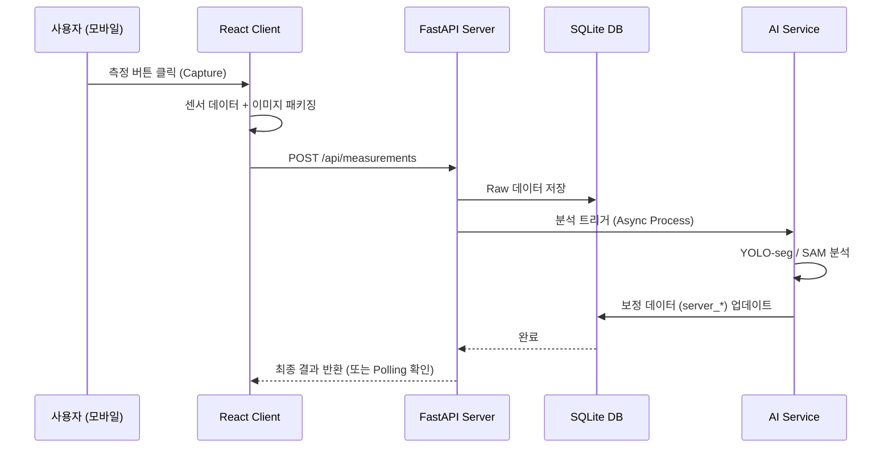

# TreeMap 데이터 흐름도 및 처리 매커니즘

TreeMap 시스템 시스템은 데이터의 생성부터 저장, 그리고 AI 분석을 통한 고도화까지 일관된 흐름을 가집니다.

## 1. 상위 수준 데이터 흐름 (High-Level Flow)

## 2. 세부 처리 단계

### 2.1 데이터 수집 (Client-side)
- 스마트폰의 하드웨어 센서로부터 초당 높은 주기로 데이터를 수집합니다.
- 측정 버튼 클릭 시 모든 센서 벡터가 동기화된 상태로 JSON 객체로 변환됩니다.
- 이미지는 전송을 위해 Base64 또는 Binary 형태로 인코딩됩니다.

### 2.2 서버측 수신 및 영속화 (Server-side Ingestion)
- FastAPI가 요청을 받으면 Pydantic 모델을 통해 데이터 유효성을 즉시 검사합니다.
- 유효한 데이터는 즉시 데이터베이스의 고유 레코드로 생성되어 '분석 대기' 상태가 됩니다.

### 2.3 하이브리드 보정 (Calibration Loop)
- **Edge Calculation**: 클라이언트에서 1차적으로 계산한 `dbh`, `height` 등이 기본 필드에 기록됩니다.
- **Server AI Correction**: 서버의 `TreeAIService`가 고해상도 이미지를 바탕으로 영역을 재분할합니다.
- **Result Fusion**: AI의 분석 결과(`server_dbh` 등)가 생성되면 `confidence` 점수와 함께 레코드가 최종 업데이트됩니다.

## 3. 시각화 피드백 (Visualization)
- 관리 대시보드(`/admin`)는 정기적으로 API를 호출하여 최신 데이터를 가져옵니다.
- 지도의 마커 및 상세 팝업에서는 **[현장 값] vs [서버 값]**의 차이를 시각적으로 비교해 보여줍니다.
