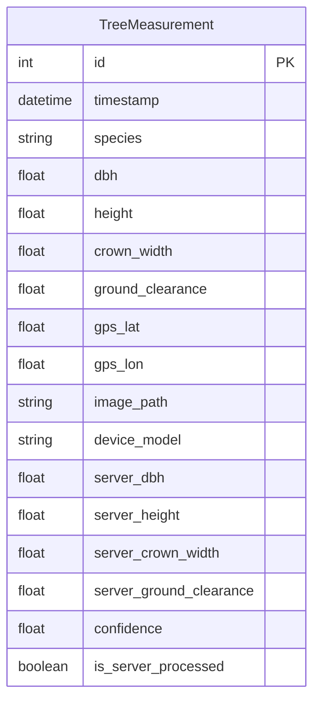

# TreeMap 데이터베이스 스키마

TreeMap은 SQLAlchemy ORM을 사용하여 수목 측정 데이터와 분석 결과를 관리합니다. 현재 SQLite를 기본 엔진으로 사용하고 있습니다.

## 1. 개요 다이어그램

## 2. 테이블 상세: `TreeMeasurement`

| 컬럼명 | 타입 | 제약 조건 | 설명 |
| :--- | :--- | :--- | :--- |
| `id` | Integer | Primary Key | 자동 증가 고유 ID |
| `timestamp` | DateTime | Default: Now | 데이터 수집 시각 |
| `species` | String | Nullable | 측정된 수종 이름 |
| `dbh` | Float | Required | 현장 측정 흉고직경 (cm) |
| `height` | Float | Required | 현장 측정 수고 (m) |
| `gps_lat` | Float | Required | 위도 |
| `gps_lon` | Float | Required | 경도 |
| `image_path` | String | Nullable | 서버에 저장된 원본 이미지 경로 |
| `server_dbh` | Float | Nullable | **AI 보정**된 흉고직경 (cm) |
| `server_height` | Float | Nullable | **AI 보정**된 수고 (m) |
| `is_server_processed` | Boolean | Default: False | 서버 AI 분석 완료 상태 플래그 |
| `confidence` | Float | Default: 0.0 | AI 분석 결과에 대한 신뢰 점수 |

## 3. 관리 지침
- **이원화 관리**: `dbh`와 `server_dbh`처럼 현장 데이터와 서버 보정 데이터를 엄격히 분리하여 저장함으로써 데이터의 추적성(Traceability)을 확보합니다.
- **인덱싱**: 위치 정보(`gps_lat`, `gps_lon`)와 `timestamp`에 대한 인덱를 통해 지도 시각화 성능을 최적화합니다.
