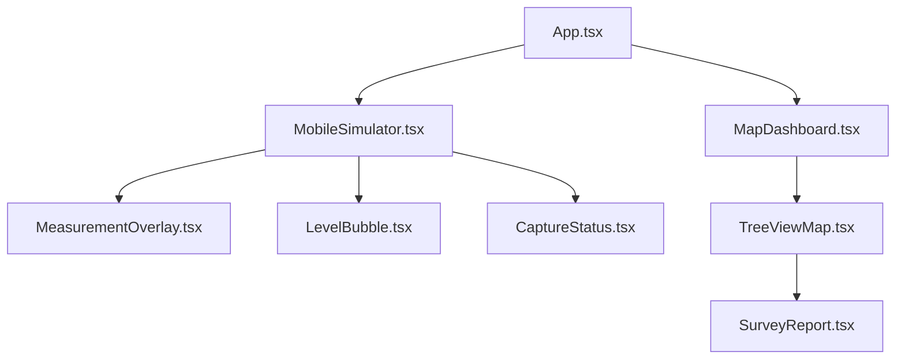

# TreeMap 프론트엔드 아키텍처

TreeMap 프론트엔드는 React 18과 TypeScript를 기반으로 구축되었으며, 현장 측정(시뮬레이터)과 관리자 분석(대시보드)이라는 두 가지 핵심 인터페이스를 제공합니다.

## 1. 컴포넌트 계층 구조

## 2. 주요 페이지 및 역할

### 2.1 모바일 시뮬레이터 (`/`)
- **목적**: 스마트폰 없이도 브라우저에서 측정 프로세스를 테스트하고 시연합니다.
- **핵심 기능**:
    - **가상 센서 시뮬레이션**: Pitch, Roll, GPS 위치 등을 슬라이더로 조절.
    - **실시간 가이드**: 기기 기울기에 따른 수평계 상태 피드백 제공.
    - **데이터 캡처**: 버튼 클릭 시 가상 센서값과 이미지를 API로 전송.

### 2.2 지도 대시보드 (`/admin`)
- **목적**: 서버에 저장된 수목 데이터를 시각화하고 관리합니다.
- **핵심 기능**:
    - **Leaflet 기반 지도**: 수목 위치를 마커로 표시하며, 병해충 상태 등에 따라 색상 구분.
    - **상세 보고서 (SurveyReport)**: 마커 클릭 시 개별 수목의 Raw 데이터와 AI 보정값 비교 표시.

## 3. 상태 관리 및 통신
- **Local State**: `useState` 및 `useEffect`를 사용한 컴포넌트 단위 상태 관리.
- **API 클라이언트**: `fetch` API를 사용하여 백엔드(`/api/measurements`)와 통신.
- **환경 변수**: Vercel 배포 시 서버 주소를 동적으로 설정할 수 있도록 설계.

## 4. UI/UX 디자인 원칙
- **Dark Mode**: 야외 현장 가독성을 고려한 어두운 테마 기반 디자인.
- **반응형 레이아웃**: 모바일 단말 화면 비율에 최적화된 뷰포트 설정 (`dvh` 단위 활용).
- **시각적 피드백**: 측정 유효성(기울기 등)에 따른 색상 변화와 애니메이션 적용.
